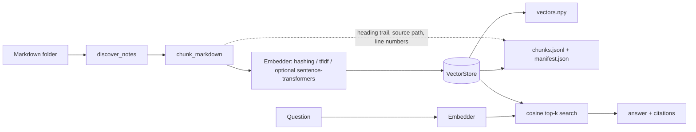

# ObsidianRAG

Minimal, fully offline retrieval-augmented search over a folder of Markdown notes:
ingest → chunk → embed → store → query with citations.

[](https://github.com/AkashNaickar/ObsidianRAG/actions/workflows/ci.yml)
[](https://github.com/AkashNaickar/ObsidianRAG/actions/workflows/gitleaks.yml)
[](LICENSE)
[](https://www.python.org/)

> **No hosted demo.** ObsidianRAG is a local command-line tool that reads and
> indexes files on your machine. There is no web app and no public URL.

## Why

Personal note vaults are large and private. ObsidianRAG gives you semantic-ish
search over them without shipping your notes to a hosted service and without
requiring an API key. The default pipeline has a single runtime dependency
(`numpy`) and is deterministic, so the same vault and question always produce
the same answer.

## Features

- **Offline by default** — no network, no API keys, no model downloads.
- **Two deterministic embedders** — signed feature hashing over word n-grams,
  and TF-IDF fitted on your corpus.
- **Optional dense embeddings** — opt in to `sentence-transformers` for
  higher-quality vectors.
- **Markdown-aware chunking** — paragraph packing that never crosses a heading,
  with overlapping windows for oversized blocks.
- **Citations with provenance** — every answer reports the source file, heading
  trail, and line range of each passage.
- **CLI + Python API** — scriptable `ingest`, `query`, and `stats` subcommands.
- **Small, testable core** — 50+ tests, Ruff lint/format, coverage gate in CI.

## Stack

| Layer      | Choice                                                                 |
| ---------- | ---------------------------------------------------------------------- |
| Language   | Python 3.11+                                                           |
| Vectors    | NumPy (cosine similarity over L2-normalised vectors)                   |
| Embeddings | feature hashing, TF-IDF, optional `sentence-transformers`              |
| Storage    | `vectors.npy` + `chunks.jsonl` + `manifest.json` in a local index dir  |
| CLI        | `argparse` (standard library)                                          |
| Quality    | pytest + coverage gate, Ruff, gitleaks                                 |

## Architecture



`ingest` walks the vault, chunks each note, embeds the heading + body of every
chunk, and writes the index. `query` embeds the question with the *same*
embedder (the index stores the embedder state), scores every chunk by cosine
similarity, and returns the top passages with citations.

## Quick start

Requires Python 3.11+.

```bash
git clone https://github.com/AkashNaickar/ObsidianRAG.git
cd ObsidianRAG
python -m venv .venv
source .venv/bin/activate        # Windows: .venv\Scripts\activate
pip install -e ".[dev]"
```

Index the bundled sample vault and ask a question:

```console
$ obsidian-rag ingest examples/notes
Indexed 13 chunks from 4 notes into .obsidianrag (hashing, dim=1024).

$ obsidian-rag query "paragraph packing and overlap for long blocks" -k 1
[1] A paragraph longer than `max_chars` is split into overlapping windows. The
`overlap` setting keeps neighbouring windows sharing a suffix and prefix so a
match that straddles a split is still retrievable.

Citations:
  [1] chunking.md > Chunking > Long blocks and overlap (lines 14-16, score 0.280)

$ obsidian-rag stats
Index:    .obsidianrag
Embedder: hashing (dim=1024)
Chunks:   13
Sources:  4
  - README.md
  - chunking.md
  - cli.md
  - embeddings.md
```

Point it at your own vault by replacing `examples/notes` with the folder that
holds your `.md` files. Tooling folders such as `.obsidian/` and `.git/` are
skipped automatically.

## Usage

### CLI

```bash
# Build or rebuild an index (defaults to ./.obsidianrag).
obsidian-rag ingest PATH/TO/VAULT

# Choose an embedder and chunking.
obsidian-rag ingest PATH/TO/VAULT --embedder tfidf --max-chars 800 --overlap 80

# Ask a question; -k controls the number of passages.
obsidian-rag query "how does chunking work" -k 3

# Machine-readable output for scripting.
obsidian-rag query "how does chunking work" --json
obsidian-rag stats --json

# Use a config file.
obsidian-rag --config config.toml ingest PATH/TO/VAULT
```

`query --json` returns:

```json
{
  "question": "paragraph packing and overlap for long blocks",
  "answer": "[1] A paragraph longer than `max_chars` is split into overlapping windows...",
  "citations": [
    {
      "index": 1,
      "source": "chunking.md",
      "heading": "Chunking > Long blocks and overlap",
      "start_line": 14,
      "end_line": 16,
      "score": 0.280
    }
  ],
  "passages": [{ "index": 1, "text": "A paragraph longer than `max_chars`..." }]
}
```

### Python API

```python
from obsidian_rag import RagIndex

index = RagIndex.build("examples/notes")  # or embedder="tfidf"
for hit in index.query("paragraph packing and overlap", top_k=3):
    print(f"{hit.score:.3f}  {hit.chunk.source}  {hit.chunk.heading}")

index.save(".obsidianrag")  # persist
loaded = RagIndex.load(".obsidianrag")  # reload and query again
print(loaded.answer("which embedders run offline?")["citations"])
```

## Configuration

All settings are optional. Precedence: CLI flag → environment variable →
TOML file → built-in default. See [`config.example.toml`](config.example.toml).

| Environment variable    | Default       | Purpose                                        |
| ----------------------- | ------------- | ---------------------------------------------- |
| `OBSIDIAN_RAG_INDEX`    | `.obsidianrag`| Index directory when `--index` is not given.   |
| `OBSIDIAN_RAG_EMBEDDER` | `hashing`     | Embedder: `hashing`, `tfidf`, `sentence-transformers`. |
| `OBSIDIAN_RAG_TOP_K`    | `5`           | Number of passages returned by `query`.        |

No environment variable is required, and none of them contain secrets.

### Embedders

| Name                   | Offline | Deterministic | Notes                                            |
| ---------------------- | ------- | ------------- | ------------------------------------------------ |
| `hashing` (default)    | Yes     | Yes           | Feature hashing over unigrams + bigrams. Fast, no fit step. |
| `tfidf`                | Yes     | Yes           | Vocabulary is fitted on your corpus; good keyword recall.   |
| `sentence-transformers`| No\*    | Yes           | Opt-in via `pip install 'obsidian-rag[embeddings]'`. Downloads a model on first use. |

\* The optional dense backend needs a one-time model download; the default two
backends never touch the network.

## Testing

```bash
pytest          # runs the suite and enforces the coverage floor
ruff check .    # lint
ruff format --check .
```

The suite covers tokenisation, chunk boundaries and line provenance, both
embedders, the vector store, the end-to-end ingest/query/save/load path, and the
CLI (including JSON output and error handling).

## Deployment

There is nothing to deploy: ObsidianRAG is a local CLI and library. It has no
server component and no hosted demo. Generated indexes (`.obsidianrag/`) are
gitignored and stay on your machine.

## Roadmap

- [ ] BM25 / hybrid lexical + vector retrieval.
- [ ] Front-matter aware chunking and tag filters.
- [ ] Optional SQLite-backed store for very large vaults.
- [ ] `--watch` mode to re-index changed notes.
- [ ] Reranking hook for the optional dense backend.

## Contributing

Contributions are welcome. Please read [CONTRIBUTING.md](.github/CONTRIBUTING.md)
and follow the [Code of Conduct](.github/CODE_OF_CONDUCT.md). For security
issues, see [SECURITY.md](.github/SECURITY.md).

## License

Released under the [Apache-2.0 License](LICENSE).
